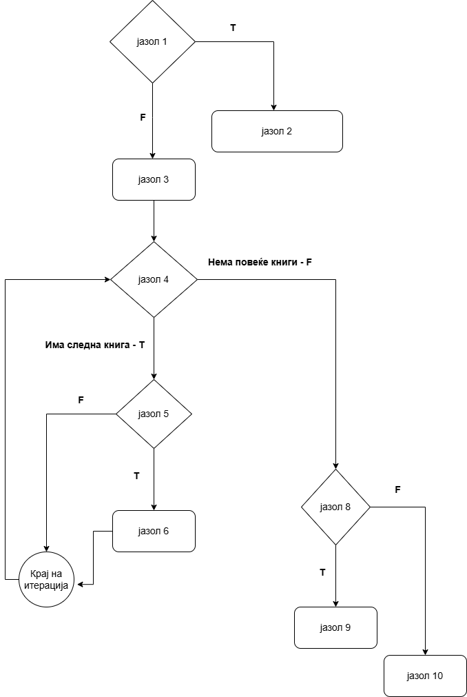
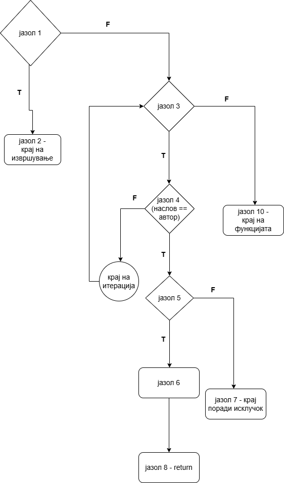

# SI_2026_lab2_246035
 * **Име и презиме:** Огнен Стојчевски
 * **Индекс:** 246035

---

 ## 1. Control Flow Graph (CFG)
 ### А. Функција `searchBookByTitle`

#### Текст од кодот со нумерирани јазли (Nodes):
```java
public List<Book> searchBookByTitle(String title) {
    if (title.isEmpty()){ // јазол 1
        throw new IllegalArgumentException("Invalid title"); // јазол 2
    }
    List<Book> results = new ArrayList<Book>(); // јазол 3
    for (Book book : books) { // јазол 4
        if (book.getTitle().equalsIgnoreCase(title) && !book.isBorrowed()) { // јазол 5
            results.add(book); // јазол 6
        } // јазол 7
    }
    if (results.isEmpty()) { // јазол 8
        return null; // јазол 9
    }
    return results; // јазол 10
}
```



### B. Функција `borrowBook`

#### Текст од кодот со нумерирани јазли (Nodes):
```java
public void borrowBook(String title, String author) {
    if (title.isEmpty() || author.isEmpty()){ // јазол 1
        throw new IllegalArgumentException("Invalid search query"); // јазол 2
    }
    for (Book book : books) { // јазол 3
        if (book.getTitle().equalsIgnoreCase(title) && book.getAuthor().equalsIgnoreCase(author)) { // јазол 4
            if (!book.isBorrowed()) { // јазол 5
                book.setBorrowed(true); // јазол 6
                System.out.println("Borrowed successfully"); // јазол 6
            } else {
                throw new RuntimeException("Book is already borrowed."); // јазол 7
            }
            return; // јазол 8
        } // јазол 9
    }
    throw new RuntimeException("Book not found"); // јазол 10
}
```


## 2.Цикломатска комплексност
Цикломатската комплексност ја пресметуваме по формулата $V(G) = P + 1$, каде што $P$ е бројот на предикатни (одлучувачки) јазли во соодветниот Control Flow Graph.
### А. Функција `searchBookByTitle`
Предикатни јазли се:
1. if (title.isEmpty()) (јазол 1)
2. for (Book book : books) (јазол 4)
3. if (book.getTitle().equalsIgnoreCase(title) && !book.isBorrowed()) (јазол 5)
4. if (results.isEmpty()) (јазол 8)
   
Пресметка: $V(G) = 4 + 1 = 5$.

### B. Функција `borrowBook`
Предикатни јазли се:
1. if (title.isEmpty() || author.isEmpty()) (јазол 1)
2. for (Book book : books) (јазол 3)
3. if (book.getTitle().equalsIgnoreCase(title) && book.getAuthor().equalsIgnoreCase(author)) (јазол 4)
4. if (!book.isBorrowed()) (јазол 5)
   
Пресметка: $V(G) = 4 + 1 = 5$.


